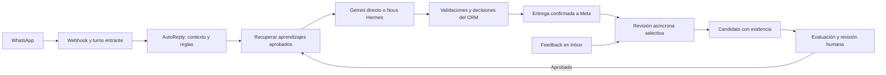

# Plan de desarrollo: memoria y mejora continua de Hermes

Estado: propuesta técnica, **sin implementación ni despliegue**. Fecha: 2026-10-08 (America/Guayaquil). Fuente de la idea: [`../../ProyectMD/prompt.md`](../../ProyectMD/prompt.md). Este documento distingue lo comprobado en el checkout local, la evidencia histórica del VPS y las comprobaciones pendientes en producción.

## 1. Resultado buscado y límites

Hermes debe aprovechar conversaciones anteriores para responder mejor a casos comerciales similares, reducir correcciones manuales y permitir medir si cada aprendizaje realmente ayuda. El circuito propuesto es:



Tres memorias cumplen funciones distintas:

| Memoria | Alcance | Fuente vigente o propuesta | Regla de uso |
| --- | --- | --- | --- |
| Contexto de una conversación | Un contacto y su conversación | `Message`, `ConversationState.summary`, `Lead.metadata.commercialProfile` | Recordar hechos del cliente; no convertir sus afirmaciones en políticas de Undercodeec. |
| Autoridad comercial | Todas las conversaciones pertinentes | `Product`, `PriceList`, políticas autorizadas en CRM | Única fuente de precios, alcance, impuestos, promociones, plazos confirmados y condiciones. |
| Experiencias aprobadas | Casos semejantes entre conversaciones | Nueva tabla `LearningItem` | Consejos de interacción y ejemplos anonimizados; subordinados a la autoridad comercial y a las guardas del backend. |

El aprendizaje **no modifica código, prompts base, precios ni políticas por sí mismo**. La confianza que estime un modelo sirve para priorizar revisión, no para publicar una regla. La propuesta de `prompt.md` de activar una regla por alcanzar 100 conversaciones o cierta confianza se deja para una etapa futura: volumen y puntuación no demuestran que la regla sea correcta ni aplicable a otro mercado. Tampoco se debe inferir que un cliente abandonó por una respuesta solo porque dejó de escribir.

No se necesita fine-tuning ni un servicio `intelligence/` independiente para la primera versión. Un módulo NestJS, PostgreSQL y una cola BullMQ encajan con el backend existente. Los embeddings se evalúan únicamente si una recuperación simple y medida resulta insuficiente.

## 2. Evidencia comprobada en el repositorio

1. `src/webhook/webhook.service.ts` persiste el inbound, aplica guardas y encola la respuesta. `src/auto-replies/auto-reply.service.ts` recupera hasta 20 mensajes, el estado y el perfil comercial; construye una instantánea autorizada, selecciona motor, valida, entrega y persiste. `src/auto-replies/inbound-turn.service.ts` coordina mensajes cercanos del cliente.
2. `src/conversation-engine/conversation-engine.service.ts` usa `HERMES_CONVERSATION_ENGINE=gemini_direct` por defecto. `nous_hermes` requiere configuración y una allowlist de UUID o `NOUS_HERMES_OPEN_INBOUND_TEST=true`. La instalación del agente VPS **no prueba** que atienda tráfico real.
3. `src/hermes/hermes.service.ts` contiene el prompt y la llamada del motor directo. `src/conversation-engine/nous-hermes.transport.ts` construye el prompt y contrato JSON del agente VPS; su petición lleva contexto por turno. `src/conversation-engine/agent-output.validator.ts` y `agent-proposal-policy.ts` validan su salida.
4. `src/hermes/commercial-policy.service.ts`, `commercial-authority.service.ts`, `commercial-claims.ts` y `src/conversation-guard/conversation-guard.service.ts` conservan reglas de respuesta, catálogo y seguridad fuera del modelo. `CommercialAuthorityService.snapshot()` obtiene ofertas vigentes de `Product`/`PriceList`; `commercialSnapshotKnowledge()` prepara el contexto comercial.
5. La ruta habitual pasa `commercialSnapshot` a `HermesService`. En `loadBusinessContext()`, una instantánea presente devuelve ese conocimiento inmediatamente; por ello, añadir un `KnowledgeDocument` o `SalesPlaybook` **no garantiza** que llegue a los turnos normales de WhatsApp. El aprendizaje necesita un campo propio en el contrato común.
6. `prisma/schema.prisma` ya modela `Conversation`, `Message`, `ConversationState`, `Lead`, `KnowledgeDocument` y `SalesPlaybook`. `ConversationState.summary` existe y se lee en `buildConversationContext()`, pero la búsqueda local no encontró un escritor regular de ese resumen. El perfil comercial se guarda en `Lead.metadata.commercialProfile` y su historial.
7. `AutomatedDelivery` ya registra preparación y confirmación de envíos. Los metadatos del primer mensaje contienen motor, modelo, `traceId`, diagnósticos y rechazos de propuestas. Se puede adjuntar allí la versión y los IDs de aprendizajes recuperados, contando como uso efectivo solo entregas confirmadas.
8. En el frontend hermano `D:/Documentos/undercodeec_nextjs`, `src/app/admin/crm/inbox/page.jsx` muestra el chat y las incidencias; `src/lib/hermes/api.js` centraliza peticiones, y `src/app/api/hermes/[...path]/route.ts` hace de proxy. No hay controles de feedback de calidad en el Inbox actual.
9. Existen `test/fixtures/conversation-engine.baseline.json`, pruebas comerciales y `src/scripts/benchmark-hermes.ts`. Son punto de partida, pero un cambio de memoria debe probar el recorrido con ambos motores, guardas y entrega simulada sin enviar a Meta.
10. `src/leads/leads.service.ts` permite `NEW → CONTACTED/QUALIFIED`, pero **no** `QUALIFIED → CONTACTED/NEW`; el error «Transición no permitida: QUALIFIED → CONTACTED» corresponde a esa regla. La UI de Pipeline y la ficha del lead ofrecen etapas que el backend rechaza. Calificar registra también un hito `LEAD_QUALIFIED` y un trabajo de sincronización publicitaria, por lo que una corrección de etapa debe preservar y conciliar esa historia.
11. El backend ya ofrece `POST /api/handoff` y `PUT /api/handoff/:id/take`; crear un handoff manual no exige rebajar la etapa del lead. Sin embargo, el Inbox solo muestra «Tomar atención» **cuando el handoff ya existe** y solo habilita la caja de texto cuando está asignado/en progreso y la ventana de WhatsApp sigue abierta. `ConversationsService.reply()` comprueba cierre y ventana de 24 horas, pero actualmente no exige un handoff activo en el servidor: la restricción del Inbox está solo en la UI. Es necesario cerrar esa discrepancia al habilitar la toma humana.

## 3. Decisiones de diseño

### 3.1 Separar revisión, memoria y ejecución

- La revisión se ejecuta **después** de una entrega confirmada o de una señal humana. No aumenta la latencia de WhatsApp. Feedback negativo e incidentes pueden revisarse enseguida; la muestra sin señal se revisa tras el siguiente mensaje, el cierre o una espera acotada para disponer de contexto posterior. En la primera versión se revisa una pequeña muestra configurable, no cada conversación; el silencio del cliente no cuenta como pérdida demostrada.
- Un revisor IA con prompt y esquema propios puede usar inicialmente la misma infraestructura de proveedor que el backend, mediante una cola aparte y presupuesto independiente. Su salida es un diagnóstico y, opcionalmente, un candidato. Nunca llama a Meta ni crea tareas comerciales.
- El candidato incluye situación, error observado, consejo breve, alcance (servicio/mercado), evidencia e incertidumbre. Se deduplica antes de aparecer en la bandeja de aprobación.
- Solo los elementos `ACTIVE` aprobados por un operador se recuperan para responder. Se limita a 2–3 elementos y a un presupuesto pequeño de caracteres/tokens. Las respuestas pasan otra vez por las validaciones existentes.
- La autoridad de `PriceList`, pagos, reserva de reuniones y handoff tiene prioridad sobre cualquier aprendizaje. Si una memoria parece contradecirla, se omite y se registra el conflicto.

### 3.2 No mezclar "caso de cliente" con "regla general"

Un mensaje como «necesito un sistema para 30 técnicos» puede aportar un ejemplo de cómo preguntar por procesos o integraciones. No autoriza la conclusión «todos los proyectos con 30 usuarios cuestan X». La revisión debe citar mensajes y correcciones, identificar contraejemplos y marcar como `NEEDS_REVIEW` cualquier afirmación comercial, legal, de pagos, privacidad o compromiso operativo.

La regla actual de responder un precio publicado cuando el cliente lo pide sigue vigente. El ejemplo de `prompt.md` «calificar antes de cotizar» se usa solo cuando **no existe un precio autorizado para el alcance solicitado**, y no para evadir una pregunta de precio que el CRM sí puede contestar.

## 4. Base de datos y flujo de memoria

### 4.1 Reutilizar lo existente

- `Message`: transcripción canónica del chat; el reviewer consulta por `conversationId` y `sourceMessageId`, sin copiar el texto completo a nuevas tablas.
- `ConversationState.summary`: resumen acotado de hechos de esa conversación. Añadir `summarySourceMessageId`, `summaryVersion` y `summaryUpdatedAt` para actualización incremental e idempotente. La primera fase puede conservar el resumen vacío; la escritura se activa tras comprobar utilidad con conversaciones largas.
- `Lead.metadata.commercialProfile`: datos comerciales del cliente con el historial actual. El resumidor no debe sobrescribir hechos corregidos por el cliente ni estados del CRM.
- `Product`/`PriceList`/política aprobada: autoridad global. `LearningItem` no contiene importes, condiciones de pago ni promesas de disponibilidad.

### 4.2 Tablas nuevas propuestas

Crear una migración Prisma aditiva, con claves foráneas e índices, sin alterar las filas históricas. Los nombres finales de enums y columnas se fijan al implementar, manteniendo este contrato funcional:

| Tabla | Campos esenciales | Relaciones e índices |
| --- | --- | --- |
| `ConversationFeedback` | `id`, `conversationId`, `messageId`, `userId`, `rating` (`GOOD`/`BAD`), `reasonCode`, `suggestedReply?`, `requestKey`, `createdAt` | FK a `Conversation`, `Message`, `User`; `requestKey` único para reintentos; índice `(conversationId, createdAt)`. Solo feedback sobre un outbound de Hermes de esa conversación. |
| `ConversationReview` | `id`, `reviewKey`, `conversationId`, `sourceMessageId`, `reviewerVersion`, `trigger`, `status`, `issueCode?`, `summary?`, `confidence?`, `providerModel?`, `createdAt` | `reviewKey` único; FK a `Conversation` y mensaje inbound; índice `(status, createdAt)`. Guardar diagnóstico breve, no conversación duplicada. |
| `LearningItem` | `id`, `fingerprint`, `version`, `status` (`PROPOSED`, `ACTIVE`, `REJECTED`, `RETIRED`), `kind`, `trigger`, `guidance`, `serviceCode?`, `market?`, `riskLevel`, `validUntil?`, `sourceReviewId?`, `approvedById?`, `approvedAt?`, `createdAt` | FK a review y aprobador; único `(fingerprint, version)`; índices por `status`, alcance y expiración. `guidance` es breve y no contiene PII. |
| `LearningEvidence` | `id`, `learningItemId`, `conversationId?`, `messageId?`, `feedbackId?`, `reviewId?`, `createdAt` | FK y unicidad por elemento/fuente. Referencia la evidencia canónica; no guarda transcripciones ni archivos. Si se elimina una fuente, revisar o retirar el elemento sin evidencia. |

`ConversationReview` y `LearningItem` no sustituyen `KnowledgeDocument`: documentos y playbooks siguen siendo material curado del CRM; `LearningItem` describe una pauta de interacción verificable. Un candidato se puede promover manualmente a documento o playbook si realmente representa conocimiento estable, con la revisión comercial normal.

La evaluación inicial usa fixtures anonimizados versionados en Git y resultados como artefactos de CI, sin tablas `Evaluation*` en producción. Si luego se necesita comparar experimentos desde el CRM, diseñar esas tablas a partir de la experiencia real de evaluación.

### 4.3 Recorrido de datos y controles de concurrencia

1. Meta entrega un `wamid` → `Message` y `InboundTurn` deduplican → `AutoReplyService` carga historia, perfil y `CommercialSnapshot`.
2. `LearningRetrievalService` busca solo `LearningItem.ACTIVE` que aplique al servicio y mercado, no esté vencido y no contradiga el snapshot. Devuelve consejos breves más `id`/`version`; ante error retorna lista vacía y emite una métrica.
3. `ConversationTurnInput.approvedContext` añade `approvedLearning` separado de `approvedKnowledge`. Ambos motores reciben el mismo campo. `HermesRequestDto` también lo acepta para `DirectGeminiEngine`.
4. El backend revisa la propuesta exactamente como hoy. Si la entrega se confirma, anota `learningItemIds` y versiones en metadatos del primer `AutomatedDelivery`, junto con motor, prompt y `traceId`. No contar como éxito las entregas `PREPARED`, `AMBIGUOUS` o suprimidas.
5. `ConversationReviewService` crea un job con clave idempotente basada en mensaje fuente, versión de rúbrica y motivo de revisión. El reviewer recibe una ventana acotada de mensajes pertinentes, feedback e información comercial de ese momento; rechaza PII y texto de instrucciones del cliente como autoridad.
6. Una revisión genera cero o un candidato. Candidatos equivalentes se agrupan por `fingerprint`; el contador de evidencias debe reflejar **conversaciones distintas**, no varios mensajes de una misma conversación. El operador aprueba, rechaza o retira con auditoría de usuario y fecha.
7. La actualización del resumen conversacional, si se habilita, usa `summarySourceMessageId` como marca de avance y una condición de versión para evitar que un job viejo pise una corrección posterior. El próximo turno lee el resumen y los mensajes recientes; el perfil del lead conserva los hechos estructurados.

## 5. Archivos a modificar y a crear

Rutas relativas a `hermes-backend/`, salvo el frontend indicado al final. Es una **propuesta de cambios**, no archivos ya implementados.

| Archivo existente a modificar | Cambio previsto |
| --- | --- |
| `prisma/schema.prisma` y una nueva `prisma/migrations/<timestamp>_conversation_learning/migration.sql` | Tablas, FKs, índices y marcadores del resumen. Migración aditiva y reversible a nivel de comportamiento. |
| `src/auto-replies/auto-reply.service.ts` | Recuperación antes de `conversationEngine.respond()`, metadatos de memoria usada y disparo de revisión después de entrega confirmada; no tocar las guardas de Meta. |
| `src/auto-replies/auto-reply.module.ts` | Importar el nuevo módulo de aprendizaje; evitar dependencias circulares usando servicios exportados. |
| `src/conversation-engine/conversation-engine.types.ts` | Añadir `approvedLearning` al contrato común con ID, versión y consejo. |
| `src/conversation-engine/direct-gemini.engine.ts` | Pasar `approvedLearning` a `HermesRequestDto`. |
| `src/hermes/dto/hermes-request.dto.ts` y `src/hermes/hermes.service.ts` | Incluir sección de aprendizajes aprobados en contexto directo, con prioridad inferior a las reglas y al snapshot comercial. |
| `src/conversation-engine/nous-hermes.transport.ts` | Añadir aprendizajes al estado aprobado, con presupuesto y aviso explícito de que no son fuente comercial ni acciones ejecutadas. Mantener contrato privado y URL fijada. |
| `src/hermes/commercial-policy.service.ts` y `src/hermes/commercial-claims.ts` | Cambiar solo si las pruebas identifican una regla de precedencia faltante; jamás dejar que la memoria autorice precios. |
| `src/conversations/conversations.service.ts` y `src/conversations/conversations.controller.ts` | Exponer feedback del mensaje, resumen de calidad y vínculos a candidatos, o dejar estas rutas en `LearningController` si evita ampliar el controlador. |
| `src/handoff/handoff.service.ts`, `src/handoff/handoff.controller.ts` y `src/conversations/conversations.service.ts` | Fase 0A: utilizar el handoff manual existente desde Inbox, comprobar propiedad del operador y exigir en backend handoff tomado antes de enviar; coordinar la cancelación/supresión de respuestas automáticas pendientes. |
| `src/leads/leads.service.ts`, `src/leads/leads.controller.ts` y `src/advertising/advertising.service.ts` | Fase 0A: distinguir transición comercial normal de corrección de una calificación equivocada, auditar motivo y conciliar el hito publicitario según su estado real. |
| `src/app.module.ts` y `.env.example` | Registrar `LearningModule` y flags `LEARNING_REVIEW_ENABLED`, `LEARNING_RETRIEVAL_ENABLED`, límites de muestra, cuota y presupuesto; valores iniciales apagados. |
| `test/fixtures/conversation-engine.baseline.json` y `src/scripts/benchmark-hermes.ts` | Añadir casos anónimos y comparación controlada con/sin memoria. Evitar que el benchmark envíe WhatsApp. |
| `src/leads/leads.service.spec.ts`, `src/handoff/handoff.service.spec.ts`, `src/conversations/conversations.service.spec.ts`, `src/auto-replies/auto-reply.service.spec.ts` | Fase 0A: corrección auditada, toma de control, ventana de 24 horas y carrera con un turno automático en curso. |

| Archivo nuevo a crear | Responsabilidad |
| --- | --- |
| `src/learning/learning.module.ts` | Prisma, BullMQ, servicios y controladores del dominio de aprendizaje. |
| `src/learning/learning.constants.ts` y `learning.processor.ts` | Cola de revisión, idempotencia, concurrencia y reintentos acotados. |
| `src/learning/conversation-review.service.ts` | Elegir eventos para revisar, ensamblar contexto, guardar revisión y deduplicar candidatos. |
| `src/learning/review-model.service.ts` y `review-output.validator.ts` | Prompt/rúbrica del revisor, cliente del proveedor, JSON estricto, límites y redacción de datos. |
| `src/learning/learning-retrieval.service.ts` | Filtrar por estado/alcance/vigencia, ordenar relevancia, detectar conflictos y recortar el presupuesto. Iniciar con etiquetas/servicio y texto; medir antes de elegir vectores. |
| `src/learning/learning-approval.service.ts` | Transiciones `PROPOSED → ACTIVE/REJECTED → RETIRED`, versión, registro de aprobador y prohibición de activar elementos de alto riesgo sin revisión. |
| `src/learning/learning.controller.ts` y `dto/*.ts` | Feedback, lista de candidatos/evidencia y decisiones protegidas por JWT y roles; aprobación restringida a ADMIN. |
| `src/learning/conversation-summary.service.ts` | Fase posterior: resumen incremental de conversación, con hechos atribuidos y marca de avance. |
| `src/learning/*.spec.ts` y `test/conversation-learning.integration-spec.ts` | Casos significativos: deduplicación, reglas de prioridad, aislamiento entre clientes, carreras y persistencia en PostgreSQL/Redis desechables. |
| `docs/conversation-learning-operations.md` | Operación, métricas, apagado de flags, revisión de incidentes y criterio de restauración. |
| `src/leads/dto/correct-lead-stage.dto.ts` (condicional) | Si la auditoría confirma una calificación errónea, contrato separado para corrección por ADMIN con destino, motivo y clave de idempotencia; nunca ampliar indiscriminadamente `ALLOWED_STAGE_TRANSITIONS`. |

Frontend hermano, en `D:/Documentos/undercodeec_nextjs/`:

| Archivo | Cambio previsto |
| --- | --- |
| `src/app/admin/crm/inbox/page.jsx` y `src/app/admin/crm/crm.css` | Fase 0A: botón «Tomar control humano» cuando Hermes está activo, luego «Tomar atención» si el handoff queda pendiente, estado de ventana y caja de respuesta. Posteriormente, botones «útil»/«corregir» junto a mensajes de Hermes. |
| `src/lib/hermes/api.js` | Método para crear handoff manual desde Inbox; posteriormente, métodos de feedback, candidatos y aprobación. |
| `src/app/admin/crm/leads/page.jsx` y `src/app/admin/crm/leads/[id]/page.jsx` | Mostrar transiciones permitidas y una vía explícita de corrección auditada; la toma de control y el envío humano pertenecen al Inbox. |
| `src/app/admin/crm/aprendizajes/page.jsx` (nuevo) | Cola de candidatos con evidencia, versión, alcance, conflictos y aprobar/rechazar/retirar. |
| `src/app/admin/crm/_components/CrmShell.jsx` | Enlace de navegación para operadores autorizados. |
| `tests/hermes-learning-feedback.test.mjs` (nuevo) | Contrato de UI y errores de feedback/aprobación. |
| `tests/hermes-inbox-human-takeover.test.mjs` (nuevo) | Inicio de handoff desde chat activo, toma por operador y estados de caja/ventana; corregir o extender pruebas existentes de Pipeline para opciones de etapa. |

El proxy `src/app/api/hermes/[...path]/route.ts` ya enruta rutas generales; verificar sus reglas de método, timeout y caché antes de modificarlo. No suponer que necesita cambios.

## 6. Fases de trabajo y criterios de cierre

### Fase 0 — línea base y auditoría del entorno servido

Inventariar SHA/digest de backend, agente y frontend; confirmar motor efectivo, allowlist, migraciones, red, recursos y capacidad de PostgreSQL/Redis. Capturar una línea base de respuestas con escenarios sintéticos y casos reales **anonimizados/autorizados**. Registrar errores por tipo, tasa de handoff, p95 de latencia, costo por revisión y versión de prompt. No desplegar learning en esta fase.

**Salida:** acta fechada con evidencias sin secretos, riesgos de capacidad y decisión sobre dónde correr el reviewer. Si la VPS difiere del checkout, reconciliar arquitectura y revisar este plan antes de programar.

### Fase 0A — caso real, corrección de etapa y atención humana en Inbox (prioridad inmediata)

Este trabajo se ejecuta **antes** del feedback general. El caso relatado: una clienta entró como lead nuevo, fue movida manualmente a `QUALIFIED`, la UI luego ofreció volver a `CONTACTED`/`NEW` y el backend respondió «Transición no permitida: QUALIFIED → CONTACTED». En el Inbox no aparece una acción para iniciar atención humana mientras Hermes controla la conversación. La conversación, según la observación del operador, muestra interés en seguir hablando, pero Hermes repite ideas, no concreta seguimiento ni explora una intención útil. **Esto es una hipótesis de calidad a comprobar turno por turno**, no una conclusión automática sobre la clienta. `ProyectMD/prompt.md` explica el learning loop, pero no contiene la transcripción identificada de este caso.

1. **Identificar y preservar la evidencia.** Con acceso autorizado, registrar internamente `leadId`, `conversationId`, IDs de mensajes, `wamid` enmascarado, tiempos y zona, etapa/historial de `AuditLog`, motor y `promptVersion`, `ConversationState`, perfil comercial, políticas/snapshot, tareas, handoff, `AutomatedDelivery` y ventana de 24 horas. Mantener texto original solo en el CRM; trabajar en Git con una versión anonimizada aprobada. No cambiar etapa ni enviar mensajes durante la inspección.
2. **Separar los dos estados.** `Lead.stage=QUALIFIED` expresa calificación comercial; `Conversation.status=ACTIVE/HANDED_OFF` expresa quién atiende el chat. Se debe poder tomar control humano **sin** devolver el lead a `CONTACTED`. Comprobar en producción si la conversación está activa, cerrada o ya tiene handoff; si está cerrada, usar el recorrido de reapertura existente antes de iniciar uno nuevo.
3. **Habilitar «Tomar control humano» en Inbox.** Sobre conversación activa sin handoff, el operador inicia `POST /api/handoff` con razón `CUSTOM` o `INFO_ERROR` y detalle interno; el backend crea/reutiliza el handoff idempotentemente y marca `HANDED_OFF`. Después, `PUT /api/handoff/:id/take` lo asigna al operador. Refrescar la vista y permitir texto solo si el handoff está tomado y la ventana de servicio sigue abierta. No crear un botón de envío desde Pipeline; este puede enlazar al Inbox. Mostrar errores recuperables si el estado cambia durante la operación.
4. **Cerrar la regla en el servidor.** Antes de llamar a Meta, `POST /api/conversations/:id/reply` debe verificar handoff abierto y asignación del operador, además de la ventana de 24 horas; revalidar el estado frente a carreras con el worker y mantener auditoría. Comprobar la guarda final de `AutomatedDelivery`: un job de Hermes ya preparado debe suprimirse al pasar a control humano, salvo un despacho a Meta ya aceptado que requiera conciliación. Evitar respuesta humana y bot simultáneas; no declarar enviado si Meta no devolvió `wamid`.
5. **Corregir la etapa por la vía adecuada.** La transición hacia atrás está excluida intencionalmente de `ALLOWED_STAGE_TRANSITIONS`; la UI no debe presentarla como un movimiento normal. Si `QUALIFIED` fue un clic equivocado, diseñar una operación **ADMIN de corrección**, con motivo, `AuditLog`, idempotencia y comprobación del `LEAD_QUALIFIED`/`AdvertisingSyncJob` existente. Si el hito sigue pendiente, evaluar su anulación controlada antes de sincronizar; si está enviado/aceptado o ambiguo, no borrarlo ni fingir que el rollback comercial lo revierte externamente: registrar la rectificación y definir conciliación específica. Si la calificación era válida, conservar `QUALIFIED` y resolver únicamente el control humano. Probar ambos caminos sin editar filas a mano.
6. **Auditar la conversación.** Construir una cronología cliente → propuesta del motor → sustituciones/políticas → mensajes realmente confirmados → reacción posterior. Comparar lo que el cliente preguntó con lo que Hermes respondió; contar repeticiones, preguntas ya contestadas, cambios de tema ignorados, seguimiento prometido sin tarea y oportunidades de una pregunta concreta o propuesta de siguiente paso. Revisar si el efecto provino del modelo, `CommercialPolicyService`, límites de contexto o reglas del worker. No atribuir una respuesta extraña al agente VPS sin verificar `conversationEngine` del mensaje.
7. **Aprender de forma controlada.** Elaborar 2–4 escenarios anónimos derivados del caso: clienta que quiere continuar, cambio de necesidad, petición de humano y corrección de clasificación. Para cada uno definir respuesta aceptable, siguiente paso permitido y antiobjetivos (repetición, presión por presupuesto, propuesta comercial inventada). Añadirlos al corpus de evaluación; el caso completo no pasa a memoria global. Solo una pauta general con evidencia y aprobación podrá convertirse luego en `LearningItem`.

**Cierre:** desde Inbox un operador puede iniciar y tomar atención sin mover la etapa; puede responder dentro de la ventana de 24 horas, y el backend impide respuestas humanas fuera del estado correcto. La UI deja de ofrecer un retroceso normal que la API rechazará. El lead afectado queda en un estado justificado, con el hito publicitario conciliado si hubo corrección. El caso conversacional tiene diagnóstico por turno y pruebas anonimizadas que demuestran una respuesta más directa y un siguiente paso pertinente, sin prometer seguimiento no registrado.

**Avance local del bloque «Tomar control humano» (08/10/2026).** Se añadió en Inbox la acción para conversaciones `ACTIVE` sin handoff, con motivo `CUSTOM`/`INFO_ERROR` y detalle interno obligatorio; llama a `POST /api/handoff`, refresca la conversación y permite tomar el handoff pendiente con el operador autenticado. La caja de respuesta se habilita solo para ese operador cuando el handoff está `IN_PROGRESS` y la ventana está abierta. El backend vuelve a comprobar estado, propietario y ventana antes de enviar a Meta, bajo el mismo bloqueo por conversación que usa el lote de entregas automáticas; el ledger suprime entregas preparadas al detectar el handoff. Se conservan la etapa comercial y la auditoría existentes. Compilaciones de backend y frontend, ESLint dirigido y 37 pruebas dirigidas pasaron en el checkout local. Queda pendiente comprobar este recorrido en el entorno servido y con el caso real autorizado; los demás puntos de Fase 0A no están cerrados.

**Continuación local de Fase 0A (08/10/2026).** Pipeline (arrastre y selector móvil) y ficha del lead ofrecen únicamente movimientos comerciales normales que `LeadsService` permite. Se ocultan los retrocesos desde `QUALIFIED`, las etapas de pago que requieren el flujo de Inbox/WhatsApp y `WON` cuando faltan datos contractuales o no se ha comprobado el estado de la transferencia. La guarda del cliente evita una solicitud accidental, mientras que la API conserva la decisión final. Pasaron dos pruebas dirigidas de la matriz de transiciones, ESLint dirigido y `pnpm build`; falta validar la interfaz servida. Esta mejora **no** corrige por sí sola el lead concreto: aún se necesita su `leadId`/`conversationId` bajo acceso autorizado, auditar `LEAD_QUALIFIED` y `AdvertisingSyncJob`, decidir si la calificación fue errónea y, solo entonces, ejecutar o diseñar la corrección ADMIN conciliada. También siguen pendientes la revisión turno a turno y los escenarios anónimos derivados del caso. No marcar Fase 0A como cerrada ni empezar Fase 1 sobre una validación E2E supuesta.

**Validación VPS reportada de Fase 0A (08/10/2026, informe recibido 12:59 America/Guayaquil).** La release web `9d63e539f571aee71e4c7c7301be2706bc0f84a2` se activó con `BUILD_ID=yKnjnnSlDMx1dZmFONRHL`, conservando `d4107c38f91d…` como `previous`. Pasaron las dos pruebas dirigidas, ESLint, build, salud PM2/Nginx y comprobación HTTPS/asset 200. La inspección de UI/artefacto confirma que `QUALIFIED` ya no ofrece `CONTACTED` ni `NEW`, sí ofrece `PROPOSAL` y deriva pagos al Inbox. No hubo lead ni sesión de prueba autorizados; no se verificó el recorrido real de toma, respuesta humana y ventana de 24 horas en esta ejecución. Siguen faltando `leadId`/`conversationId` y autorización para auditar el caso, dictaminar la calificación, conciliar `LEAD_QUALIFIED`/`AdvertisingSyncJob`, revisar la conversación turno por turno y crear escenarios anónimos. **Fase 0A permanece abierta.**

### Fase 1 — feedback útil sin IA adicional

Migración de `ConversationFeedback`, endpoint JWT, botones en Inbox e identificadores exactos del mensaje evaluado. Permitir feedback positivo/negativo y corrección opcional. Añadir vistas simples de volumen y motivos. Es la fuente de ejemplos de calidad para no depender únicamente del juicio de otro modelo.

**Cierre:** un operador marca una respuesta y la ve asociada al mensaje correcto; reintentar la misma solicitud no duplica el feedback; otro rol no puede aprobar; ningún feedback modifica una respuesta enviada.

### Fase 2 — reviewer asíncrono y candidatos

Crear cola separada, contrato de salida estricto, `ConversationReview` y `LearningItem`/evidencias. Arrancar solo con feedback negativo e incidentes; después muestrear algunos turnos sin señal humana. Usar cuota diaria y pausa automática si suben errores o costo. Generar candidato únicamente si existe evidencia concreta y un problema generalizable; guardar `NO_LEARNING` cuando no lo hay. Revisar sesgos: mercado, servicio, secuencia de mensajes, respuestas humanas y corrección posterior del cliente.

**Cierre:** idempotencia tras reinicio y reintento, candidato sin PII, ninguna llamada a Meta, fallos del reviewer aislados del chat, deduplicación y explicación breve de evidencia/contraejemplos en el CRM.

### Fase 3 — aprobación, recuperación y sombra

Implementar aprobación/retirada y recuperación de `ACTIVE`. Primero ejecutar en modo sombra: registrar qué se habría recuperado **sin incluirlo en el prompt**, comparar pertinencia y conflictos, y medir costo/latencia. Después habilitar una allowlist de conversaciones o porcentaje estable; habilitar ambos motores por separado. Mantener el límite 2–3 memorias y versionar cada cambio.

**Cierre:** casos ajenos no se mezclan; precio solicitado y disponible se responde; precio no autorizado sigue bloqueado; prompts maliciosos, ejemplos viejos y memorias vencidas no alteran guardas; apagar `LEARNING_RETRIEVAL_ENABLED` restaura la ruta previa sin borrar datos.

### Fase 4 — resumen largo y evaluación continua

Habilitar resumen incremental solo si los casos largos muestran pérdida de contexto real. Reutilizar `ConversationState.summary`, validar hechos frente a mensajes y perfil, no inferir datos del cliente. Extender benchmark a pares antes/después, rúbricas objetivas por escenario y revisión humana ciega de una muestra. Registrar por separado calidad de la respuesta, resultado comercial observado y acciones ejecutadas: correlación no implica causalidad.

**Cierre:** una conversación larga recuerda datos correctos tras superar los 20 mensajes recientes, conserva correcciones, no filtra datos de otro contacto y no cambia precios. La evaluación demuestra mejora en casos objetivo sin regresiones en controles críticos.

## 7. Evaluación, métricas y puertas de publicación

- Dataset: conservar fixtures sintéticos de seguridad, precio, plazo, pagos, humano, múltiples negocios, cambio de tema, cliente corrigiendo un dato, soporte, conversación larga y candidato contradictorio. La Fase 0A añade casos de interés continuado, respuesta repetitiva y toma humana desde Inbox. Los casos reales se anonimizan antes de convertirse en fixtures; no copiar chats ni números a Git.
- Comparación: mismo contexto y snapshot autorizado, mismo motor/modelo cuando sea posible, memoria apagada/encendida, salida final **después** de las políticas del backend. Ejecutar por motor; no mezclar resultados de Gemini directo y Nous.
- Evaluación automática: JSON válido, precio/moneda/mercado correcto, ausencia de promesas no ejecutadas, respeto a handoff, ausencia de PII, pregunta pertinente, no repetir pregunta, uso correcto de un aprendizaje. La revisión humana cubre naturalidad y utilidad comercial.
- Métricas productivas: feedback negativo por 100 respuestas confirmadas, tasa de candidatos aprobados/rechazados/retirados, memorias recuperadas y usadas, conflictos descartados, p50/p95 de latencia, costo de reviewer por conversación, fallos de cola, recurrencia del mismo error y regresiones por segmento.
- Puerta de salida: cero regresiones en casos críticos y evidencia de mejora en el segmento objetivo; umbrales numéricos de calidad/costo se fijan **después** de medir la línea base de la VPS. No aceptar una mejora promedio si empeoran casos de pagos, precios o derivación.
- Trazabilidad: guardar versiones de prompt, reviewer, rúbrica, memoria y motor; permitir retirar inmediatamente una memoria y reconstruir qué turnos la usaron mediante metadatos de entregas confirmadas.

## 8. Auditoría de VPS antes de implementación

**Estado del corte local anterior:** no hubo acceso SSH ni lectura directa de contenedores/BD de la VPS. Posteriormente, el operador aportó el informe de auditoría de solo lectura generado por Codex en la VPS y conservado localmente en `../../logs.log`; sus resultados fechados se incorporan abajo como evidencia **reportada**, sin acceso independiente de esta sesión a los comandos ni a sus salidas originales. El registro `ProyectMD/hermes-agent-vps-handoff.md` describe una observación del **21/09/2026**, no el estado actual: agente, puente API y egress separados, red privada `hermes_client_api`, backend conectado a esa red, agente sin acceso directo a CRM/BD/Redis/Meta y datos del agente en SQLite persistente. Ese registro describe al agente sin herramientas ni acceso directo a CRM/BD/Redis/Meta; por tanto, la memoria propuesta vive en el backend/CRM y debe llegar al agente mediante el contrato de cada turno, aun si el agente conserva su propio estado interno. `docker-compose.yml` local define `app`, PostgreSQL, Redis, n8n y una red externa solo para `app`.

Ejecutar una sesión **solo de lectura**, desde una cuenta autorizada, sin imprimir `env_file`, tokens, prompts, números ni conversaciones:

```bash
date -u
docker ps --format '{{.Names}} {{.Image}} {{.Status}}'
docker inspect hermes-app --format '{{.Image}}'
docker network inspect hermes_client_api --format '{{range .Containers}}{{.Name}} {{end}}'
docker stats --no-stream hermes-app nous-hermes-agent hermes-postgres hermes-redis
docker exec hermes-app printenv HERMES_CONVERSATION_ENGINE NOUS_HERMES_OPEN_INBOUND_TEST
docker exec hermes-app node -e 'const x=(process.env.NOUS_HERMES_CONVERSATION_ALLOWLIST||"").split(",").filter(Boolean); console.log("nous_allowlist_count="+x.length)'
docker exec hermes-app node -e 'require("node:dns").lookup("nous-hermes-api",(e,a)=>{console.log(e?"dns_error":"dns_ok"); process.exit(e?1:0)})'
docker exec hermes-app npx prisma migrate status
```

Confirmar además por acceso autorizado y sin volcar contenido sensible: estado de salud del API privado, digest real del agente, límite de CPU/RAM, capacidad libre de PostgreSQL y Redis, política de backups/restauración, salud de colas, fecha de migraciones, flags activos, permisos de operador y versión de la web. Para saber qué motor respondió de verdad, consultar metadatos de entregas confirmadas o eventos `auto_reply_sent` con IDs anonimizados; la configuración por sí sola no basta ante allowlist. Un healthcheck `200` tampoco prueba que el JSON del agente sea aceptado por el validador CRM.

La auditoría termina en un acta con columnas `componente | versión/digest | evidencia y fecha | observado/pediente | impacto en el plan`. No copiar secretos, salida completa de `docker inspect`, `.env` ni chats a este documento. Si no hay acceso, mantener estas afirmaciones como **pendientes de verificación** y no prometer un despliegue viable en producción.

### Acta de Fase 0 — corte local del 08/10/2026, 11:09 (America/Guayaquil)

Alcance de este corte: inspección del checkout y ejecución local de pruebas, sin conexión SSH a la VPS, consultas a la base servida, llamadas al proveedor de IA ni envíos a Meta. El equipo tiene cliente SSH, pero no hay alias configurado ni destino autorizado disponible en esta sesión. Los SHA siguientes identifican **checkouts locales**, no releases desplegadas.

| Componente | Versión/digest | Evidencia y fecha | Observado/pendiente | Impacto en el plan |
| --- | --- | --- | --- | --- |
| Backend local | `cfbd00ca8979f84499745d2ac4afdc25139f6af5` | `git rev-parse HEAD`, 08/10/2026. | Observado; árbol con cambios ajenos y este plan aún sin seguimiento en Git. Digest de `hermes-app` servido pendiente. | No equiparar código local con producción antes de diseñar la migración o activar flags. |
| Frontend local | `94882e99124464821cdc8fe884541711fdd69531` | `git -C D:/Documentos/undercodeec_nextjs rev-parse HEAD`, 08/10/2026. | Observado; release/`BUILD_ID` servido pendiente. También hay cambios locales ajenos. | Confirmar versión real de Inbox antes de Fase 0A/1. |
| Agente Nous | Digest pendiente. | Sin acceso a contenedor; registro histórico del 21/09/2026 en `ProyectMD/hermes-agent-vps-handoff.md`. | Estado actual, imagen y capacidad pendientes. | No asignar el reviewer al agente por su sola presencia histórica. |
| Selección del motor | Checkout: `gemini_direct` por defecto, allowlist vacía y modo abierto `false` en `.env.example`. | `conversation-engine.service.ts`, `.env.example`, 08/10/2026. | Motor configurado y motor **efectivo** en entregas servidas pendientes. | Consultar metadatos de entregas `CONFIRMED` por motor antes de comparar respuestas o atribuir errores a Nous. |
| Esquema y migraciones | 19 directorios locales; última `20261002000000_transfer_payments`. | `prisma/schema.prisma`, `prisma/migrations`, 08/10/2026. | `prisma migrate status` de la base servida pendiente. | La migración de learning debe partir del esquema realmente aplicado. |
| Red y recursos | Compose local: red externa `hermes_client_api` solo en `app`; PostgreSQL 16 y Redis 7 declarados. | `docker-compose.yml`, 08/10/2026. | Red, límites CPU/RAM, espacio, backups, restauración y salud de colas en VPS pendientes. | Capacidad y aislamiento del reviewer sin decisión definitiva. |
| Corpus sintético | `conversation-engine.baseline.json` versión 1, 24 casos. | Fixture local, 08/10/2026. | Escenarios declarados; aún no hay ejecución de respuestas finales contra el entorno servido. | Conservar estos casos y completar la medición por motor con guardas y entrega simulada. |
| Regresión local | 7 suites y 271 pruebas aprobadas; `npm run build` correcto. | Jest dirigido y compilación local, 08/10/2026. | Verifica el checkout, no calidad observada de respuestas ni despliegue. | Punto de control reproducible para detectar regresiones posteriores. |

**Línea base de métricas:** errores por tipo en producción, tasa de handoff, p95 de latencia y distribución real por motor: **pendientes**, porque faltan eventos/entregas del entorno servido y una ventana de medición definida. El costo por revisión es **no aplicable** antes de implementar el reviewer; su presupuesto y cuota se fijarán con datos de capacidad. El prompt directo se versiona en código con los primeros 12 caracteres de SHA-256 del `systemPrompt`, pero la versión efectiva del proceso servido y el prompt del agente siguen pendientes. No se consultaron conversaciones reales ni se incorporaron ejemplos de clientes al corpus.

`benchmark:hermes` no sirve aún como medida del recorrido completo: requiere `HERMES_BENCHMARK_LIVE=true`, llama directamente al proveedor con escenarios propios y puede generar costo; no ejecuta webhook, snapshot comercial, políticas finales ni ledger de entrega. Antes de medir respuestas con/sin memoria, preparar un recorrido sintético que evalúe la **salida final** del backend para cada motor, sin enviar a Meta, y registrar versión de prompt, modelo y criterios por escenario.

**Decisión provisional de ubicación:** mantener el reviewer como módulo/cola separados en el backend, evaluando la infraestructura de proveedor ya usada por el backend según capacidad y costo observados en VPS. No reservar recursos del agente Nous ni habilitar learning hasta verificar CPU/RAM, PostgreSQL, Redis, salud de colas, cuota y latencia actuales. Si la arquitectura servida difiere de este checkout, reconciliarla aquí antes de implementar.

**Pendientes al cierre de este corte local:** obtener evidencia del entorno servido sobre digests/SHA, migraciones, motores efectivos, errores, handoff, latencia, backups y capacidad; ejecutar casos sintéticos por motor con salida final; identificar casos reales solo con autorización y anonimización. El informe VPS recibido después resuelve parte de esos puntos y actualiza los pendientes a continuación.

### Acta de Fase 0 — informe VPS del 08/10/2026, 11:22–11:28 (America/Guayaquil)

Fuente: informe de Codex ejecutado en la VPS, entregado por el operador en `../../logs.log`. Fue una auditoría de lectura de contenedores, PostgreSQL, Redis y metadatos; no hubo despliegue, reinicio, envío a Meta ni llamadas sintéticas facturables. El informe registra que una búsqueda accidental recorrió nombres de archivos bajo `/var/backups`, sin mostrar contenidos ni alterar copias; esto no valida los backups. Los datos siguientes son **observaciones reportadas por ese agente**, no una inspección SSH repetida desde este checkout.

| Componente | Versión/digest | Evidencia y fecha | Observado/pendiente | Impacto en el plan |
| --- | --- | --- | --- | --- |
| Backend servido | `hermes-backend-app:latest`, ID de imagen `sha256:a81abb0e1afe28752d5a2ba8e7b214644413adb305a62974b0263c335c6e246b`. | Docker, 08/10; contenedor creado el 06/10 e imagen el 02/10. | Activo; SHA de código servido **pendiente** porque la imagen no tiene label de revisión ni `.git`. | No atribuirle `cfbd00c` por coincidir con un checkout presente en la VPS. |
| Frontend servido | `94882e99124464821cdc8fe884541711fdd69531`. | Nginx apunta a `/var/www/current`, release con Git limpio, 08/10. | SHA servido observado; coincide con el checkout local de referencia. | La UI de Fase 0A debe evaluarse contra esta release. |
| Agente y puente | Agente `nousresearch/hermes-agent:v2026.9.14`, ID `sha256:99641e57ec762c59e54cb44aa6746b7fc68c18b3c5ddb088af54234c613d9294`, label de revisión `345cd2b057a452236de401d3534b8502a7465e8d`; puente/egress `haproxy:3.2-alpine`. | Docker, 08/10. | Contenedores activos y sanos; identificador de prompt del agente pendiente. | Salud del proceso no acredita calidad ni contrato de respuesta final. |
| Motor efectivo | `HERMES_CONVERSATION_ENGINE=nous_hermes`, modo inbound abierto `true`, allowlist con 0 entradas; 19/19 respuestas confirmadas registraron `nous_hermes`/`hermes-agent`. | Configuración y metadatos de entregas, 08/10. | Uso de Nous observado en la ventana; modelo subyacente no verificado. | Evaluar primero Nous; el default `gemini_direct` del código no describe este runtime. |
| Prompt directo | Hash de 12 caracteres `2000f753b461`. | Calculado del artefacto compilado sin imprimir prompt; coincide con checkout de referencia, 08/10. | Versión identificada; 0 respuestas directas confirmadas en la ventana. | El hash del prompt no demuestra el SHA completo del backend servido. |
| Migraciones | 19 aplicadas, 0 sin finalizar; última `20261002000000_transfer_payments`. | `prisma migrate status` y `_prisma_migrations`, 08/10. | Nombres coinciden con el conjunto local; no hay discrepancia detectada. | Esquema observado listo para diseñar migración aditiva, tras resolver versión del código. |
| Red privada | `hermes_client_api` conecta `hermes-app` y puente; DNS y `/health` HTTP 200 desde app; puerto 8642 sin publicación detectada. | Red/Docker/host/Nginx, 08/10. | Conectividad observada; contrato JSON no probado por healthcheck. | Mantener la separación del agente y validar salida con el CRM en pruebas sintéticas. |
| PostgreSQL y Redis | PostgreSQL 16.14, base de 11 MB; Redis 7.4.9, 3,26 MB usados, `maxmemory=0`. | Docker, base e `INFO`, 08/10. | Activos/sanos; Redis sin límite propio de memoria configurado. | Dimensionar cola de revisión según capacidad real, no tamaño actual de datos. |
| Colas | `automatic-whatsapp-replies` y `nous-hermes-inference`. | Contadores BullMQ, 08/10. | Espera/activos/diferidos/fallidos retenidos: 0 en una muestra; no reconstruye reintentos históricos. | Sin backlog instantáneo; capacidad bajo carga pendiente. |
| Backups | `.dump` con fecha de archivo hasta 03/10 19:18 UTC; RDB local guardado el 08/10 16:17 UTC. | Solo metadatos e `INFO persistence`, 08/10. | Frecuencia, última tarea exitosa, copia independiente de Redis y restauración probada **pendientes**. | No considerar satisfecho el requisito de recuperación. |

**Línea base productiva reportada.** Ventana `[2026-10-01 00:00, 2026-10-08 00:00)` UTC: 35 mensajes inbound en **una** conversación; 19 respuestas `HERMES_REPLY` con primera parte `CONFIRMED` (25 partes confirmadas en total), todas Nous y todas el 06/10. Handoff: `0/1 = 0 %`, según conversaciones con inbound que crearon un handoff en la misma ventana. Entregas creadas en ventana: `REJECTED 0`, `AMBIGUOUS 0`, `SUPPRESSED 1` por `NEWER_INBOUND`; los logs agregados registraron 12 `NEWER_INBOUND_DURING_GENERATION` y 2 `NEWER_INBOUND`. Son eventos/estados de distintos puntos del flujo y no se suman como una tasa única de error. En 15/19 primeras partes Nous hubo al menos un `proposalRejection`, pero solo 1/19 registró cambio del texto propuesto; un rechazo de propuesta no implica por sí mismo una respuesta errónea.

La latencia `latencyMs` reportada para Nous fue p50 **15 458 ms** y p95 **21 782 ms** (`n=19`, sin faltantes): mide procesamiento hasta preparación, antes de la espera y el envío a Meta. El intervalo desde persistencia del inbound hasta `confirmedAt` fue p50 **24 133 ms** y p95 **31 574 ms** (`n=19`). Las dos series provienen de una sola conversación y no caracterizan carga diversa. `costEstimate` faltó en 19/19 entregas y tampoco hubo valores útiles en `Message`; costo por respuesta **N/D**. Costo por revisión **no aplicable** porque no existe reviewer activo. No hubo respuestas directas para medirlas ni feedback/learning estructurado observado.

**Corpus y capacidad.** El fixture sintético de 24 casos está en la release, pero no se ejecutaron escenarios de respuesta final con Nous ni Gemini directo: aciertos/fallos **N/D** para ambos. El benchmark existente llama directamente al proveedor y no recorre snapshot, políticas y entrega simulada. No se entregaron casos reales ya autorizados y anonimizados ni el ID interno del caso `QUALIFIED` de Fase 0A. La VPS reportó 3 CPU, 3,8 GiB RAM, cerca de 1,5 GiB disponibles en una muestra, 687 MiB de swap usados y disco principal al 84 % (8,8 GiB libres). `hermes-app` usó 71,23 % CPU en una muestra instantánea, sin cuota propia; esto no es un percentil bajo carga. El agente tiene límite de 0,75 CPU/512 MiB, pico de 512 MiB y 1 227 eventos de presión `max`, sin OOM; faltan series bajo carga. La ubicación del reviewer en un módulo/cola del backend sigue siendo **provisional**; no se aprobó activación ni cuota.

**Pendientes de cierre actualizados:** (1) vincular la imagen backend servida con un commit mediante manifest/label o evidencia de build; (2) verificar frecuencia, última ejecución exitosa y restauración de backups PostgreSQL/Redis; (3) medir CPU/RAM/swap/disco, colas y reintentos bajo carga representativa; (4) preparar un harness aislado sin Meta que mida salida final de los 24 escenarios por motor con snapshot y versión de prompt; (5) obtener casos reales solo si ya están autorizados y anonimizados. Con una sola conversación productiva y ninguna respuesta sintética evaluada, no se pueden fijar umbrales de calidad, costo ni una decisión definitiva de capacidad. **Fase 0 continúa abierta**; no iniciar Fase 0A/1 sobre la premisa de que la línea base ya está completa.

### Acta de Fase 0 — informe VPS recibido el 08/10/2026, 12:59 (America/Guayaquil)

Fuente: respuesta de Codex en VPS entregada en `../../logs.log`. Es evidencia reportada por ese agente; este checkout no repitió una inspección SSH. El despliegue web citado en Fase 0A no modificó `hermes-app` ni los datos. El backend servido, digest del agente, motor efectivo y migraciones **no se revalidaron en este informe**; para esos datos conserva vigencia solo el corte anterior.

| Área | Evidencia nueva reportada | Límite y decisión |
| --- | --- | --- |
| Release web | `9d63e539f571aee71e4c7c7301be2706bc0f84a2`, `BUILD_ID=yKnjnnSlDMx1dZmFONRHL`; anterior `d4107c38f91d…`, `BUILD_ID=KIdr2a1lH4sZ2xTMfl-bK`. `current` apunta a la nueva release y `previous` conserva la anterior. PM2 web/API online, `nginx -t` correcto, CRM HTML 200 y asset activo 200. | Despliegue y artefacto servidos comprobados según informe; no equivale a una sesión E2E del operador. |
| Backups | Archivos recientes PostgreSQL 16:53 UTC y Redis 16:55 UTC. Restauración PostgreSQL aislada: 35 tablas no sistémicas. Redis cargó RDB en entorno aislado, pero la base seleccionada quedó con 0 claves y no se inspeccionó contenido. | La restauración PostgreSQL aporta evidencia útil; la recuperabilidad de datos Redis sigue sin demostrarse. No se halló timer/cron operativo de Hermes ni se verificaron retención o copia externa. |
| Capacidad | 3,8 GiB RAM total, ~2,2 GiB disponible, ~936 MiB swap usado, 7,2 GiB libres y disco al 87 % en reposo. | No se aplicó carga a producción. Faltan mediciones representativas aisladas de CPU/RAM/swap/disco, colas, reintentos y p95. El espacio libre disminuyó respecto del corte anterior; mantener provisional la ubicación del reviewer y sin activación. |
| Evaluación | Replay aislado: 81/81 pruebas aprobadas con recorridos simulados de ambos motores, políticas y entrega con dobles. | Verifica lógica simulada, no calidad de respuestas de Nous/Gemini reales ni costo o latencia de proveedor. Persisten resultados por motor **N/D** para el corpus con proveedores reales. |

**Pendientes de cierre al nuevo corte:** configurar y verificar backup automático, retención, copia externa y restauración de datos Redis; medir capacidad bajo carga aislada representativa; ejecutar el corpus de salida final con proveedores reales, cuota acotada, rúbrica, latencia y costo; vincular la imagen backend servida con su commit; completar el caso real autorizado de Fase 0A. **Fase 0 continúa abierta.**

## 9. Seguridad, retención y operación

- El reviewer lee solo el tramo necesario y redacta teléfonos, correos, referencias, comprobantes y datos de pago. Los nuevos registros guardan referencias y hallazgos breves, no copias completas del chat. Los medios de pago se quedan en el circuito actual de Meta/Inbox.
- Las memorias activas son de interacción, no hechos de otro cliente. Nunca incluir nombre, negocio, presupuesto o preferencias individuales de un tercero en el contexto de otra conversación. La memoria por contacto sigue dentro de su `conversationId`/`Lead`.
- Todo contenido de cliente se trata como dato no confiable, incluso si aparece citado en una evidencia. El revisor y el recuperador no pueden ejecutar herramientas ni publicar política. Una corrección de operador tampoco debe convertir un precio escrito a mano en precio aprobado.
- Respetar borrado/retención de conversaciones y revocación aplicable: al eliminar origen, borrar evidencias asociadas y retirar aprendizajes que queden sin soporte. Definir el plazo exacto con la política de datos operativa antes de encender revisión de conversaciones reales.
- Reviewer separado en BullMQ con concurrencia y cuota propias; nunca compartir la cola de respuesta a WhatsApp ni permitir que un backlog de revisión retrase `auto-reply`. Al fallar Redis/modelo, el chat sigue su flujo normal y la revisión queda para recuperación.
- Flags iniciales `LEARNING_REVIEW_ENABLED=false`, `LEARNING_RETRIEVAL_ENABLED=false`, `LEARNING_SUMMARY_ENABLED=false`. Desactivar recuperación es el rollback inmediato; retirar un candidato es el rollback por regla. La migración puede quedar aplicada sin que cambie el comportamiento.

## 10. Guía de continuación para próximas sesiones

1. Leer este plan, `ProyectMD/estado-proyecto.md`, `docs/nous-hermes-runbook.md`, `prisma/schema.prisma` y comprobar `git status --short` antes de editar. Los cambios actuales ajenos en documentos/Calendar pertenecen al usuario y no se mezclan.
2. Registrar fecha, commit backend, release frontend, digest del agente, motor efectivo y migraciones **con evidencia nueva**. No promover una observación histórica a estado actual.
3. Si se consigue acceso VPS, completar la sección 8 y actualizar **este mismo archivo** con un apartado de resultados fechados, sin crear estados paralelos ni pegar secretos. Ajustar primero decisiones de capacidad/ubicación del reviewer.
4. Resolver primero la Fase 0A del caso real y la toma humana desde Inbox; la corrección de etapa depende de verificar el hito comercial/publicitario del lead concreto. Después implementar las fases 1–4 en orden. Cada PR debe incluir migración y rollback conductual, pruebas pertinentes, rutas de API y capturas de comportamiento del CRM sin datos reales. Mantener flags apagados hasta pasar la evaluación.
5. Antes de activar recuperación, dejar constancia de corpus de evaluación, resultados por motor, aprobación responsable, porcentaje/allowlist de canary, métricas observables y procedimiento para apagar el flag.

### Preguntas que debe resolver la auditoría, no la intuición

- ¿Qué motor atiende hoy los inbound reales y cuántas conversaciones pasan por Nous?
- ¿Cuál es el código/imagen exacto servido y qué migraciones están realmente aplicadas?
- ¿El agente VPS tiene capacidad ociosa para revisar conversaciones, o conviene ejecutar el reviewer con la cuota del proveedor ya usado por el backend?
- ¿Dónde y durante cuánto tiempo se retienen los chats y backups, y qué proceso borra datos a solicitud del cliente?
- ¿Qué rol del CRM aprobará candidatos y qué volumen de feedback puede revisar cada semana?
- ¿Cuáles son los tres errores recurrentes reales que justifican el primer dataset, sin confundir preferencias estilísticas con fallos comerciales?
- ¿Cuál es el `conversationId`/`leadId` interno del caso relatado, qué motor respondió, qué mensajes fueron confirmados y cuál es el estado de `LEAD_QUALIFIED`/su sincronización?
